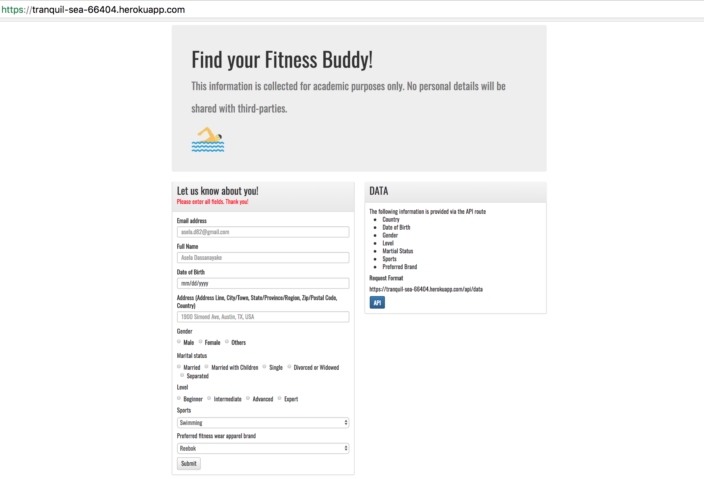
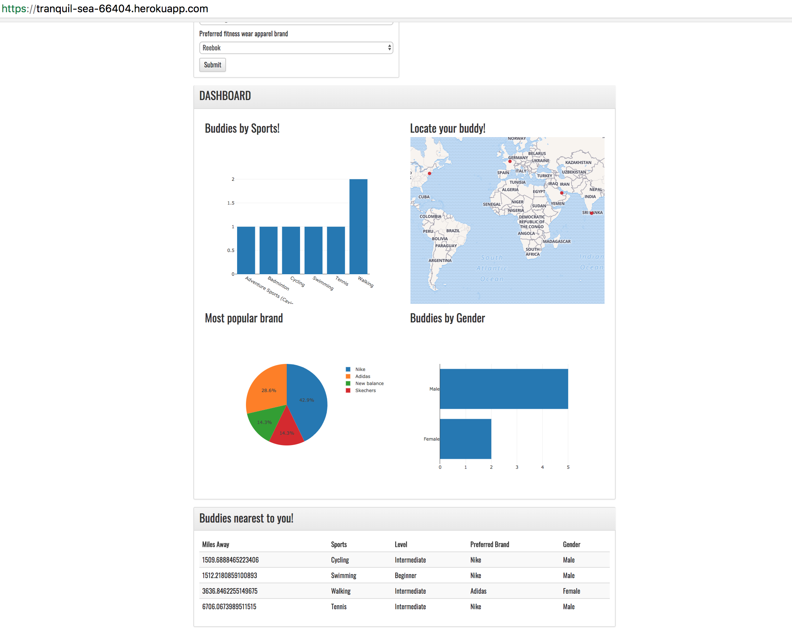

## Find your fitness buddy 
##### Full-Stack Data Analytics Web Application

Based on your fitness requirement, the application will locate a buddy for you! The application is deployed on Heroku at the following link https://tranquil-sea-66404.herokuapp.com/.

#### Key features

Interactive dashboard based on Plotly.js
API route for users to extract data to carry out further analysis.
A simple recommendation that lists information about the closest buddies based on distance(miles).

#### Technology stack used:

* ClearDB(Platform-As-A-Service built on MySQL)
* Pandas
* Flask microframework
* SQLAlchemy(Python SQL toolkit and Object Relational Mapper)
* Javascript
* Plotly.js(Visualization)
* HTML/CSS/Bootstrap
* Google Geocoding API/ Mapbox
* Heroku

#### User Interface

#### Things to do once the app reaches 500 users

* Create further visualizations using d3.js

* Incorporate collaborative filterting to refine the recommendation algorithem

